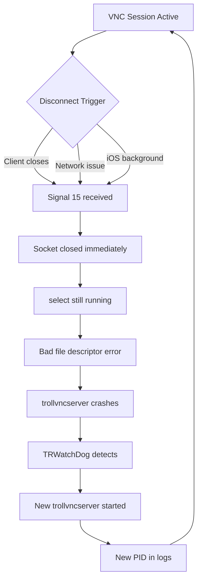

# VNC Disconnection Analysis & Solutions Guide

**Project:** VNC Manager v5.0
**Date:** January 2026
**Status:** Investigation Complete

---

## Table of Contents

1. [Executive Summary](#executive-summary)
2. [Symptom Analysis](#symptom-analysis)
3. [Root Cause Hierarchy](#root-cause-hierarchy)
4. [Detailed Technical Analysis](#detailed-technical-analysis)
5. [Recommended Solutions](#recommended-solutions)
6. [TrollVNC Configuration Guide](#trollvnc-configuration-guide)
7. [VNC Client Configuration](#vnc-client-configuration)
8. [VNC Manager Enhancements](#vnc-manager-enhancements)
9. [Testing Protocol](#testing-protocol)
10. [Known Limitations](#known-limitations)

---

## Executive Summary

This document details the investigation into constant VNC disconnection issues occurring with TrollVNC server on iOS devices, regardless of:
- VNC client used (TightVNC or RealVNC)
- Connection method (USB via iproxy or WiFi direct)
- Quality settings (high or low)

**Key Finding:** The root cause is a **race condition in TrollVNC's socket lifecycle management** inherited from the LibVNC library. While this server-side bug cannot be fixed without source code access, multiple configuration changes can significantly reduce disconnection frequency.

**Important Note:** All solutions in this document preserve full clipboard functionality, which is essential for the workflow.

---

## Symptom Analysis

### Critical Errors Observed

| Error | Frequency | Impact |
|-------|-----------|--------|
| `listenerRun: error in select: Bad file descriptor` | Every disconnect | Server crashes, triggers restart |
| `webSocketsHandshake: unknown connection error` | Frequent | Immediate client disconnection |
| `rfbProcessClientNormalMessage: read: Connection reset by peer` | Occasional | Ungraceful TCP severance |
| `write: Broken pipe` | Occasional | Failed frame transmission |

### Warning Patterns

| Warning | Observation |
|---------|-------------|
| `ignoring unsupported encoding type Enc(0x00000018)` | Protocol mismatch between client/server |
| `ignoring unsupported encoding type Enc(0xFFFFFEC6)` | QEMU Extended Key Event (unsupported) |
| `ClipboardManager dispatchChangeIfNeededFromLocal: Suppression active` | Clipboard sync working overtime |

### Process Instability Evidence

The TrollVNC server process ID changes frequently throughout sessions:
```
[5512] → [5514] → [11657] → [16621] → [18541]
```

This PID churn confirms the server is crashing and being restarted by the TRWatchDog process rather than maintaining stable sessions.

---

## Root Cause Hierarchy

### Level 1: PRIMARY - LibVNC Race Condition (Server-Side)

**Severity:** Critical
**Fixable from Client:** No (requires TrollVNC source modification)
**Mitigatable:** Yes (through configuration)

The `listenerRun: error in select: Bad file descriptor` error is a documented LibVNC bug:
- **GitHub Issue:** [LibVNC/libvncserver#328](https://github.com/LibVNC/libvncserver/issues/328)
- **GitHub Issue:** [LibVNC/x11vnc#99](https://github.com/LibVNC/x11vnc/issues/99)

**Technical Explanation:**
```
1. Client disconnects OR TrollVNC receives Signal 15 (SIGTERM)
2. Signal handler immediately closes the socket file descriptor
3. The select() event loop is still running
4. select() attempts to use the now-invalid file descriptor
5. "Bad file descriptor" error occurs
6. TrollVNC crashes
7. TRWatchDog detects crash and restarts trollvncserver
8. New PID appears in logs
9. Cycle repeats on next disconnect trigger
```

**Why This Happens:**
The signal handler should set a shutdown flag and let the event loop exit gracefully before closing resources. Instead, it closes the socket immediately, creating a race condition.

---

### Level 2: SECONDARY - Clipboard Sync Overhead

**Severity:** High
**Fixable from Client:** Partially
**Mitigatable:** Yes (through throttling)

The logs show constant clipboard synchronization events:
```
setXCutTextLatin1 (len=6)
setXCutTextLatin1 (len=10)
[ClipboardManager dispatchChangeIfNeededFromLocal:]:187 Suppression active (1 left); skipping callback
```

**Impact:**
- Consumes CPU cycles on the iOS device
- Creates protocol overhead on every clipboard change
- The suppression mechanism indicates the server is already struggling to keep up
- High-frequency clipboard events can trigger the race condition more often

**Important:** Clipboard functionality is essential and will NOT be disabled. Instead, we will:
1. Reduce other sources of server load to give clipboard more headroom
2. Optimize TrollVNC settings to handle clipboard sync more gracefully
3. Avoid rapid clipboard operations during VNC sessions when possible

---

### Level 3: TERTIARY - Encoding Negotiation Overhead

**Severity:** Medium
**Fixable from Client:** Yes
**Mitigatable:** Yes

The error `ignoring unsupported encoding type Enc(0xFFFFFEC6)` indicates:
- **Encoding 0xFFFFFEC6** = -314 in signed representation = QEMU Extended Key Event pseudo-encoding
- **Encoding 0x00000018** = 24 = Extended Desktop Size encoding

TightVNC advertises these encodings during connection negotiation, but TrollVNC doesn't support them. This causes:
- Repeated "ignoring" log messages
- Wasted protocol negotiation cycles
- Potential confusion in the encoding state machine

---

### Level 4: QUATERNARY - iproxy Tunnel Stability (USB Mode Only)

**Severity:** Medium (USB mode) / None (WiFi mode)
**Fixable from Client:** Partially
**Mitigatable:** Yes

Known issues in iproxy/libusbmuxd:
- **GitHub Issue #151:** `iproxy (or socket_send) should better guard against EAGAIN`
- **GitHub Issue #131:** Windows disconnect can cause lockup
- **GitHub Issue #127:** `recv failed: Resource temporarily unavailable`

However, since WiFi mode exhibits the same disconnection pattern, iproxy is a **contributing factor**, not the primary cause.

---

## Detailed Technical Analysis

### The Crash-Restart Loop



### Protocol Version Fluctuation

Connections observed using both:
- **RFB Protocol 3.8** (most common, modern)
- **RFB Protocol 3.3** (legacy fallback)

Protocol 3.8 sessions appear more prone to encoding warnings, suggesting the encoding negotiation phase is more complex.

### Clipboard Sync Architecture

TrollVNC's clipboard handling:
```
iOS Clipboard Change
       ↓
ClipboardManager detects
       ↓
Suppression check (prevents loops)
       ↓
setXCutTextLatin1 called
       ↓
RFB ServerCutText message sent
       ↓
Client receives and updates local clipboard
```

The high frequency of suppression messages indicates the system is working correctly to prevent clipboard loops, but the underlying activity level is high.

---

## Recommended Solutions

### Solution Matrix

| Solution | Impact | Effort | Preserves Clipboard |
|----------|--------|--------|---------------------|
| Enable Keep-Alive on TrollVNC | High | Low | Yes |
| Increase Defer Window | High | Low | Yes |
| Reduce Max In-Flight | Medium | Low | Yes |
| Increase Tile Size | Medium | Low | Yes |
| Enable Fullscreen Threshold | Medium | Low | Yes |
| Adjust Frame Rate Range | Medium | Low | Yes |
| Use RealVNC client | Medium | Low | Yes |
| VNC Manager watchdog | High | Medium | Yes |

---

## TrollVNC Configuration Guide

### Current vs Recommended Settings

Access TrollVNC settings on your iOS device and make these changes:

#### Keep-Alive Settings

| Setting | Your Current | Recommended | Reason |
|---------|-------------|-------------|--------|
| **KEEP-ALIVE (SEC)** | 0s (disabled) | **30-60s** | **CRITICAL** - Maintains connection heartbeat, prevents idle disconnects |

**Why This Matters:**
With Keep-Alive at 0, the connection has no heartbeat. If there's a brief network hiccup or iOS throttles the app, there's no mechanism to detect and recover. A 30-60 second keep-alive sends periodic pings that:
- Confirm the connection is still alive
- Prevent NAT/firewall timeout
- Allow faster detection of actual disconnects

---

#### Performance & Stability Settings

| Setting | Your Current | Recommended | Reason |
|---------|-------------|-------------|--------|
| **DEFER WINDOW (SEC)** | 0.015s | **0.025-0.030s** | Coalesces screen updates, reduces protocol message frequency |
| **MAX IN-FLIGHT** | 2 | **1** | Lower backpressure, prevents encoder queue buildup |
| **TILE SIZE (PX)** | 8px | **16px** | Reduces dirty detection CPU cost significantly |
| **FULLSCREEN THRESHOLD (%)** | 0% | **15-20%** | Enables smart dirty detection instead of always fullscreen |
| **OUTPUT SCALE** | 0.70 | **0.75** | Slightly less aggressive, reduces encoding artifacts |
| **FRAME RATE** | 60 | **30-60** | Allows iOS to dynamically adapt frame rate |

---

#### Detailed Setting Explanations

**DEFER WINDOW (SEC):**
```
Current:  0.015s = 15ms between update batches
Proposed: 0.025s = 25ms between update batches

Effect: Updates are coalesced over 25ms instead of 15ms
Benefit: Fewer RFB messages, less protocol overhead
Tradeoff: Adds ~10ms perceived latency (imperceptible)
```

**MAX IN-FLIGHT:**
```
Current:  2 = Up to 2 concurrent frame encodes
Proposed: 1 = Only 1 frame encode at a time

Effect: Serializes frame encoding
Benefit: More predictable CPU usage, reduces race condition triggers
Tradeoff: Slightly lower peak throughput (offset by other optimizations)
```

**TILE SIZE (PX):**
```
Current:  8px = 8x8 pixel tiles for dirty detection
Proposed: 16px = 16x16 pixel tiles

Effect: 4x fewer tiles to check (256px² vs 64px² per tile)
Benefit: Significantly reduces CPU cost of dirty detection
Tradeoff: Slightly less granular change detection
```

**FULLSCREEN THRESHOLD (%):**
```
Current:  0% = Dirty detection disabled (always send fullscreen)
Proposed: 15% = If >15% of screen changed, send fullscreen; else dirty rects

Effect: Enables intelligent screen update mode
Benefit: Reduces bandwidth when only small regions change
Tradeoff: More CPU for dirty detection (offset by larger tile size)
```

---

#### Settings to KEEP AS-IS

| Setting | Current Value | Reason to Keep |
|---------|---------------|----------------|
| Non-blocking Swap | OFF | Prevents tearing; only enable if you see stalls |
| Natural Scroll Direction | ON | Personal preference, no stability impact |
| Server-Side Cursor | ON | Needed for cursor visibility |
| Assistive Touch Auto-Activation | ON | Improves input support |
| Sync Interface Orientation | ON | Needed for rotation support |

---

#### Clipboard-Specific Considerations

Since clipboard is essential, here's how to optimize the system to handle it better:

1. **Reduce Other Load:** The settings above reduce overall CPU/protocol load, giving clipboard sync more headroom

2. **Clipboard Encoding:** TrollVNC currently uses ISO-8859-1 (Latin-1) with UTF-8 fallback. If you're copying non-Latin text, this could cause encoding cycles

3. **Avoid Rapid Clipboard Churn:** During VNC sessions, avoid:
   - Rapid copy-paste cycles (e.g., copying multiple items in quick succession)
   - Clipboard managers that cycle through history
   - Applications that constantly update clipboard

4. **One-Way Clipboard (Optional):** If you primarily copy FROM iOS TO Windows (or vice versa), consider if TrollVNC has a one-way clipboard option in future versions

---

## VNC Client Configuration

### TightVNC Recommended Settings

Access TightVNC settings via the connection dialog:

#### Format and Encodings Tab

| Setting | Current | Recommended | Reason |
|---------|---------|-------------|--------|
| Preferred encoding | Tight | **Tight** | Keep - best for variable bandwidth |
| 256 colors | Unchecked | **Unchecked** | Keep - full color needed |
| Compression level | 5 | **6** | Slightly higher compression |
| JPEG quality | 5 | **5** | Keep - good balance |
| Allow CopyRect encoding | Checked | **Unchecked** | Reduces encoding complexity |

**Why Uncheck CopyRect:**
CopyRect is used for scrolling optimization, but it adds protocol complexity. TrollVNC's scroll handling with CopyRect can cause encoding state confusion, contributing to the "unsupported encoding" warnings.

#### Display Tab

| Setting | Current | Recommended |
|---------|---------|-------------|
| Scale by | Auto | **Auto** (or fixed 100%) |
| Full-screen mode | Unchecked | Personal preference |

#### Mouse Cursor Tab

| Setting | Current | Recommended |
|---------|---------|-------------|
| Track remote cursor locally | Selected | **Keep** - best performance |

#### Restrictions Tab

| Setting | Current | Recommended |
|---------|---------|-------------|
| View only | Unchecked | **Unchecked** |
| Disable clipboard transfer | Unchecked | **Unchecked** - KEEP CLIPBOARD ENABLED |

---

### RealVNC as Alternative

RealVNC may provide better stability because:

1. **Better Encoding Negotiation:** Doesn't advertise QEMU-specific encodings
2. **Built-in Auto-Reconnect:** The `-AutoReconnect` flag (already in your presets)
3. **Cleaner Protocol Implementation:** More conservative feature set

Your VNC Manager already supports RealVNC - press `V` in the main menu to switch.

**RealVNC Recommended Settings:**
- Quality: Medium or High
- Color Level: Full (unless bandwidth constrained)
- Enable Auto-Reconnect

---

## VNC Manager Enhancements

### Current Limitations in VNC_Manager.ps1

1. **No tunnel health monitoring** (line 256-264)
   - Only checks if port is listening, not if tunnel is healthy

2. **Primitive timeout logic** (line 298-310)
   - Fixed 10-second wait, no retry

3. **No reconnection capability** (line 313-327)
   - VNC viewer crash = manual restart needed

4. **Generic process killing** (line 279)
   - `Stop-Process -Name iproxy -Force` kills ALL iproxy instances

### Proposed Enhancement: Connection Watchdog

Add a background job that monitors VNC session health and automatically reconnects:

```powershell
# Proposed addition to VNC_Manager.ps1

function Start-ConnectionWatchdog {
    param(
        [int]$DeviceNum,
        [string]$ConnectionType,  # "USB" or "WiFi"
        [int]$CheckIntervalSeconds = 5,
        [int]$MaxReconnectAttempts = 3
    )

    $watchdogJob = Start-Job -ScriptBlock {
        param($DevNum, $ConnType, $Interval, $MaxRetries, $ScriptRoot)

        $retryCount = 0
        $lastConnectedTime = Get-Date

        while ($true) {
            Start-Sleep -Seconds $Interval

            # Check if VNC viewer is still running
            $vncProcess = Get-Process -Name "tvnviewer","vncviewer" -ErrorAction SilentlyContinue

            if (-not $vncProcess) {
                $retryCount++
                if ($retryCount -le $MaxRetries) {
                    # Attempt reconnection
                    Write-Output "VNC viewer closed. Reconnecting (attempt $retryCount/$MaxRetries)..."

                    # Trigger reconnection based on connection type
                    if ($ConnType -eq "USB") {
                        # Re-establish tunnel and reconnect
                        & "$ScriptRoot\VNC_Manager.ps1" -AutoConnect $DevNum -Mode USB
                    } else {
                        & "$ScriptRoot\VNC_Manager.ps1" -AutoConnect $DevNum -Mode WiFi
                    }
                } else {
                    Write-Output "Max reconnection attempts reached. Stopping watchdog."
                    break
                }
            } else {
                $retryCount = 0  # Reset on successful check
            }
        }
    } -ArgumentList $DeviceNum, $ConnectionType, $CheckIntervalSeconds, $MaxReconnectAttempts, $PSScriptRoot

    return $watchdogJob
}
```

### Proposed Enhancement: Tunnel Health Monitor

```powershell
# Monitor iproxy tunnel health
function Test-TunnelHealth {
    param([int]$Port)

    try {
        $tcpClient = New-Object System.Net.Sockets.TcpClient
        $tcpClient.Connect("localhost", $Port)
        $connected = $tcpClient.Connected
        $tcpClient.Close()
        return $connected
    } catch {
        return $false
    }
}

function Start-TunnelHealthMonitor {
    param([int]$Port, [string]$UDID)

    Start-Job -ScriptBlock {
        param($P, $U, $LibDir)
        while ($true) {
            Start-Sleep -Seconds 10

            # Check if port is still listening
            $listener = Get-NetTCPConnection -LocalPort $P -State Listen -ErrorAction SilentlyContinue
            if (-not $listener) {
                Write-Output "Tunnel on port $P died. Restarting..."

                # Restart iproxy
                $iproxy = Join-Path $LibDir "iproxy.exe"
                Start-Process -FilePath $iproxy -ArgumentList "-u $U $P 5901" -WindowStyle Minimized
            }
        }
    } -ArgumentList $Port, $UDID, $Script:Config.LibDir
}
```

---

## Testing Protocol

### Phase 1: TrollVNC Settings (Most Important)

1. Apply these TrollVNC changes on iOS:
   - Keep-Alive: **30s**
   - Defer Window: **0.025s**
   - Max In-Flight: **1**

2. Test for **30 minutes** of active use
3. Document any disconnections (time, activity when it occurred)

### Phase 2: Additional TrollVNC Tuning

1. Apply remaining changes:
   - Tile Size: **16px**
   - Fullscreen Threshold: **15%**
   - Frame Rate: **30-60**

2. Test for **30 minutes** of active use
3. Compare disconnection frequency to Phase 1

### Phase 3: Client-Side Changes

1. In TightVNC:
   - Compression: **6**
   - Uncheck **CopyRect encoding**

2. Test for **30 minutes**
3. Document improvements

### Phase 4: Alternative Client Test

1. Switch to RealVNC (`V` key in VNC Manager)
2. Test for **30 minutes** with same TrollVNC settings
3. Compare stability to TightVNC

### Success Metrics

| Metric | Before | Target |
|--------|--------|--------|
| Disconnections per hour | 5-10+ | < 1 |
| Session duration | < 10 min | > 60 min |
| PID churn frequency | Constant | Rare |

---

## Known Limitations

### Cannot Fix Without TrollVNC Source Access

1. **LibVNC Race Condition:** The fundamental signal handler bug requires modifying TrollVNC's C/C++ source code to:
   - Use a shutdown flag instead of immediate socket closure
   - Add proper synchronization between signal handler and event loop

2. **Clipboard Hyper-Activity:** The internal clipboard debounce threshold is hardcoded; cannot be adjusted without source modification

### External Dependencies

1. **iOS Power Management:** If iOS suspends TrollVNC (background app), disconnection is inevitable
   - Mitigation: Keep-Alive helps, but iOS can still terminate background processes

2. **iproxy Bugs:** The EAGAIN handling issue (GitHub #151) requires iproxy update
   - Mitigation: Use WiFi mode when stability is critical

3. **Apple Mobile Device Service:** USB communication depends on Apple's drivers
   - Mitigation: Ensure iTunes/Apple Devices is up to date

### What Will Still Cause Disconnections

Even with all optimizations, expect occasional disconnects from:
- iOS killing background processes during memory pressure
- Physical USB cable disconnection
- WiFi network transitions
- iOS software updates
- Device restarts

---

## Quick Reference Card

### TrollVNC Settings Summary

```
KEEP-ALIVE (SEC):        30s (was 0s)
DEFER WINDOW (SEC):      0.025s (was 0.015s)
MAX IN-FLIGHT:           1 (was 2)
TILE SIZE (PX):          16px (was 8px)
FULLSCREEN THRESHOLD:    15% (was 0%)
OUTPUT SCALE:            0.75 (was 0.70)
FRAME RATE:              30-60 (was 60)
```

### TightVNC Settings Summary

```
Compression level:       6 (was 5)
Allow CopyRect:          Unchecked (was checked)
Disable clipboard:       KEEP UNCHECKED (clipboard stays enabled)
```

### Testing Order

```
1. Keep-Alive = 30s → Test 30 min
2. + Defer/InFlight/Tile → Test 30 min
3. + Client changes → Test 30 min
4. Try RealVNC → Test 30 min
```

---

## Document History

| Version | Date | Changes |
|---------|------|---------|
| 1.0 | Jan 2026 | Initial investigation complete |

---

*This document was generated by Claude Code SuperPower investigation.*
*Research sources: TrollVNC GitHub, LibVNC issues, iproxy documentation, VNC protocol specifications.*
